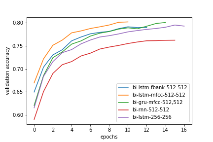

# Sequence Labeling

## Description
>  use TIMIT dataset to predict phoneme sequences using provided mfcc or fbank features

Project [Link](https://www.csie.ntu.edu.tw/~yvchen/f106-adl/A1)

## Requirements
* keras
* tensorflow
* python3
* h5py
* sklearn

## Dataset
* TIMIT Dataset
* Features: mfcc and fbank
* Labels: 48 kinds of phones

## Pre-Processing
**Label Preprocessing**
1. phone mapping 48 -> 39
2. converting sequences to one hot encodings
3. padding

**Features Preprocessing**
1. standardization
2. padding

## Post-Processing
1. convert phoneme to alphabet
2. remove consecutive duplicates using a threshold
3. trim the 'sil' character

## Results

